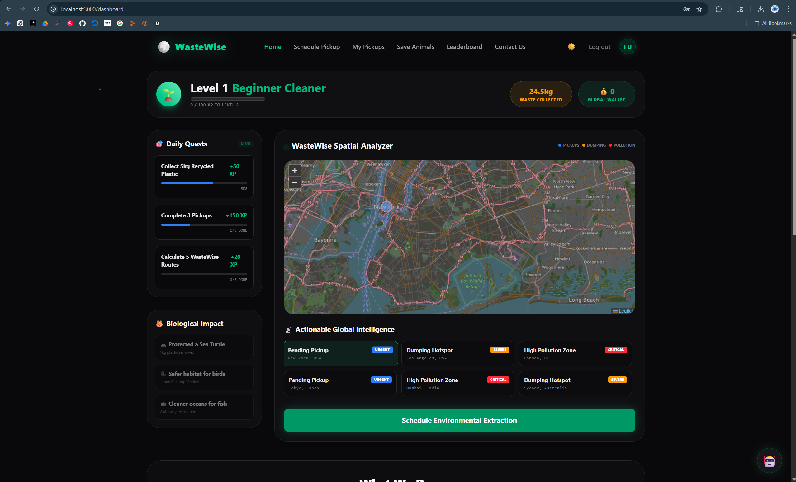

# WasteWise

WasteWise is a MERN stack environmental logistics platform with gamified user engagement, pickup tracking, an AI chat assistant, and admin tools for managing users and routes.



## What is in this repo

- `frontend/` - React + Vite client
- `backend/` - Express + MongoDB API
- `scripts/` - small PowerShell helpers for setup and local development

## Local setup

Prerequisites:

- Node.js 18 or newer
- npm 9 or newer

Run these commands from the repo root:

```bash
npm run setup
npm run dev
```

What those commands do:

- `npm run setup` installs dependencies for both `backend/` and `frontend/`
- `npm run dev` starts the backend on `http://localhost:5000` and the frontend on `http://localhost:3000`

Open `http://localhost:3000` in your browser after the servers start.

## Demo login

The backend seeds these accounts automatically:

- User: `demo@wastewise.app` / `DemoUser123!`
- Admin: `admin@wastewise.app` / `DemoAdmin123!`

## Features

- JWT authentication
- Role-based access control for users and admins
- Google OAuth login
- Pickup request flow with map-based location selection
- Email status updates for pickups
- AI chat assistant for waste and recycling questions
- Route logging and CO2 tracking
- Admin dashboard for moderation and analytics

## Tech stack

- React
- Vite
- Tailwind CSS
- Express
- Mongoose
- MongoDB
- Nodemailer
- Google OAuth
- Gemini API

## Notes

- The backend listens on `http://localhost:5000`
- The frontend runs on `http://localhost:3000`
- A local in-memory MongoDB fallback is used if `MONGO_URI` is not set

## License

MIT
